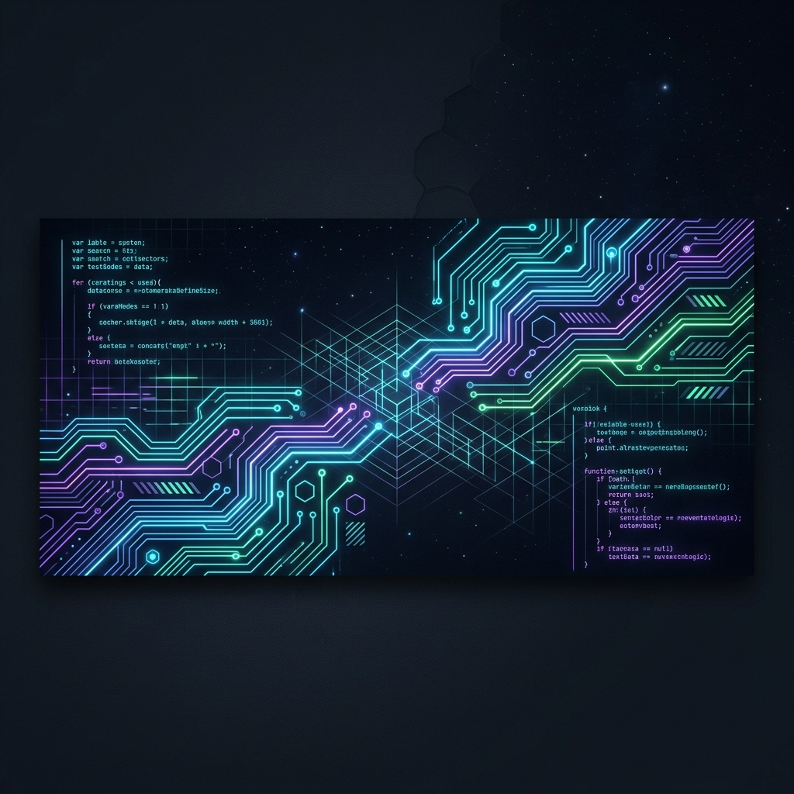
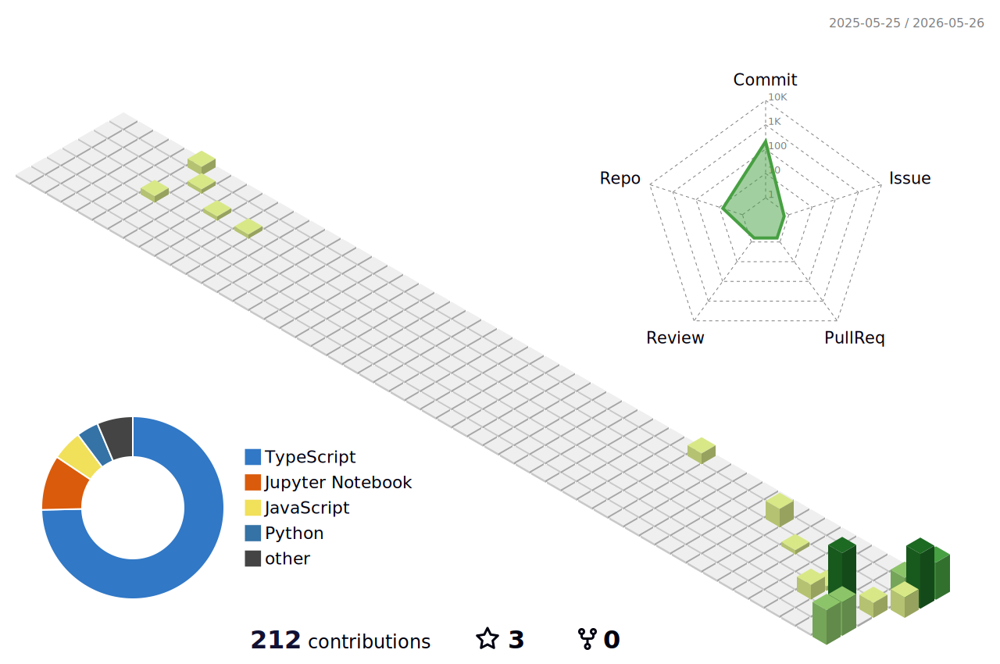

# Hi there, I'm Janak Kabra! 👋

  

  

  

 

  <table width="98%" cellspacing="0" cellpadding="0" style="background-color: #1e1e1e; border: 1px solid #3c3c3c; border-radius: 8px; font-family: -apple-system, BlinkMacSystemFont, 'Segoe UI', Roboto, Helvetica, Arial, sans-serif; overflow: hidden; box-shadow: 0 10px 30px rgba(0,0,0,0.5);">
    <!-- Title Bar -->
    <tr style="background-color: #323233; height: 35px; color: #cccccc; font-size: 13px;">
      <td colspan="2" style="padding-left: 12px; border-bottom: 1px solid #252526; vertical-align: middle;">
        ●
        ●
        ●
        Visual Studio Code — developer.ts
      </td>
    </tr>
    <!-- Editor Workspace -->
    <tr>
      <!-- Sidebar Explorer (25% width) -->
      <td width="25%" valign="top" style="background-color: #252526; border-right: 1px solid #3c3c3c; font-family: 'SF Mono', Monaco, Consolas, monospace; font-size: 12px; color: #cccccc; padding: 12px; line-height: 1.6;">
        
EXPLORER: PROJECTS

        
📂 jenak26

        &nbsp;&nbsp;📄 developer.ts 
        &nbsp;&nbsp;📄 skills.json 
        &nbsp;&nbsp;📄 config.yaml 
        &nbsp;&nbsp;📄 skyline_generator.sh
          
        
OUTLINE

        &nbsp;&nbsp;🔷 class JanakKabra 
        &nbsp;&nbsp;&nbsp;&nbsp;&nbsp;&nbsp;◽ name 
        &nbsp;&nbsp;&nbsp;&nbsp;&nbsp;&nbsp;◽ level 
        &nbsp;&nbsp;&nbsp;&nbsp;&nbsp;&nbsp;◽ stack 
        &nbsp;&nbsp;&nbsp;&nbsp;&nbsp;&nbsp;⚙️ getFocus() 
        &nbsp;&nbsp;&nbsp;&nbsp;&nbsp;&nbsp;⚙️ getPhilosophy()
      </td>
      <!-- Editor Code Content (75% width) -->
      <td width="75%" valign="top" style="background-color: #1e1e1e; font-family: 'SF Mono', Monaco, Consolas, 'Courier New', monospace; font-size: 13px; color: #d4d4d4; padding: 0px 0px 15px 0px; line-height: 1.5;">
        <!-- Tab Bar -->
        

          

            TS developer.ts
          

        

        <!-- Code Content -->
        

          import { Developer, Student } from 'world';  
          /** 
          &nbsp;* @class JanakKabra 
          &nbsp;* @desc Second-year CS student pushing the boundaries of web experiences. 
          &nbsp;*/ 
          class JanakKabra extends Student implements Developer { 
          &nbsp;&nbsp;public readonly name = "Janak Kabra"; 
          &nbsp;&nbsp;public readonly level = "CS Student (Year 2)"; 
          &nbsp;&nbsp;public readonly stack = [ 
          &nbsp;&nbsp;&nbsp;&nbsp;"TypeScript", "JavaScript", "Python", "C++", 
          &nbsp;&nbsp;&nbsp;&nbsp;"React", "TailwindCSS", "Zustand", "HTML5 Canvas", 
          &nbsp;&nbsp;&nbsp;&nbsp;"Web Audio API", "Git", "Vercel" 
          &nbsp;&nbsp;];  
          &nbsp;&nbsp;public getFocus(): string[] { 
          &nbsp;&nbsp;&nbsp;&nbsp;return [ 
          &nbsp;&nbsp;&nbsp;&nbsp;&nbsp;&nbsp;"Visual physics & web simulation engines", 
          &nbsp;&nbsp;&nbsp;&nbsp;&nbsp;&nbsp;"Hardware-accelerated web UI (HTML5 Canvas rendering)", 
          &nbsp;&nbsp;&nbsp;&nbsp;&nbsp;&nbsp;"High-performance algorithmic systems" 
          &nbsp;&nbsp;&nbsp;&nbsp;]; 
          &nbsp;&nbsp;}  
          &nbsp;&nbsp;public getPhilosophy(): string { 
          &nbsp;&nbsp;&nbsp;&nbsp;return "Simplicity is the ultimate sophistication. Performance is the beauty."; 
          &nbsp;&nbsp;} 
          }
        

      </td>
    </tr>
  </table>

 

  
  

---

### 🛠️ Tech Stack & Toolkit

  

---

### 📊 System Diagnostics

<table border="0" align="center">
  <tr>
    <td align="center" width="50%">
      
    </td>
    <td align="center" width="50%">
      
    </td>
  </tr>
  <tr>
    <td colspan="2" align="center" width="100%">
      
    </td>
  </tr>
</table>

---

### 🏙️ 3D Contribution Skyline City

This 3D isometric skyline is programmatically generated from my GitHub contribution history. Each building represents a day of code, with its height corresponding to commit frequency. Updated daily:

  

---

  <i>"Simplicity is the ultimate sophistication. Performance is the ultimate beauty."</i>

