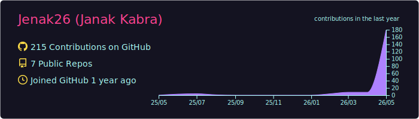
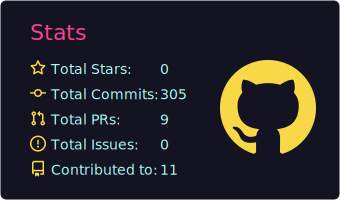
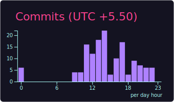
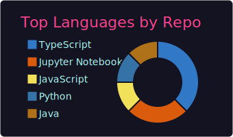
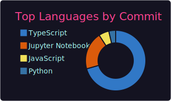

  

  
  &nbsp;
  
  &nbsp;
  
  &nbsp;
  

  

---

### Technical Skills

  <table width="98%" cellspacing="0" cellpadding="10" style="background-color: #0d1117; border: 1px solid #30363d; border-radius: 8px; font-family: 'SF Mono', Consolas, Fira Code, monospace; overflow: hidden; border-collapse: collapse;">
    <tr style="background-color: #161b22; height: 35px;">
      <td colspan="6" style="padding: 10px 15px; border-bottom: 1px solid #30363d; font-size: 13px; color: #ff4d4d; font-weight: bold; letter-spacing: 1px;">
        ⚡ CORE_ACTIVE_SUB_SYSTEMS // ENVIRONMENT
      </td>
    </tr>
    <tr>
      <!-- Row 1 -->
      <!-- TypeScript -->
      <td align="center" width="16.6%" style="padding: 15px; border: 0;">
         
        TypeScript
      </td>
      <!-- JavaScript -->
      <td align="center" width="16.6%" style="padding: 15px; border: 0;">
         
        JavaScript
      </td>
      <!-- Python -->
      <td align="center" width="16.6%" style="padding: 15px; border: 0;">
         
        Python
      </td>
      <!-- C++ -->
      <td align="center" width="16.6%" style="padding: 15px; border: 0;">
         
        C++
      </td>
      <!-- C# -->
      <td align="center" width="16.6%" style="padding: 15px; border: 0;">
         
        C#
      </td>
      <!-- Java -->
      <td align="center" width="16.6%" style="padding: 15px; border: 0;">
         
        Java
      </td>
    </tr>
    <tr>
      <!-- Row 2 -->
      <!-- React -->
      <td align="center" style="padding: 15px; border: 0;">
         
        ReactJS
      </td>
      <!-- Tailwind -->
      <td align="center" style="padding: 15px; border: 0;">
         
        Tailwind
      </td>
      <!-- ThreeJS -->
      <td align="center" style="padding: 15px; border: 0;">
         
        Three.js
      </td>
      <!-- Framer Motion -->
      <td align="center" style="padding: 15px; border: 0;">
        

          
        

        Framer Motion
      </td>
      <!-- GSAP -->
      <td align="center" style="padding: 15px; border: 0;">
        

          GSAP
        

        GSAP
      </td>
      <!-- HTML5 -->
      <td align="center" style="padding: 15px; border: 0;">
         
        HTML5
      </td>
    </tr>
    <tr>
      <!-- Row 3 -->
      <!-- CSS3 -->
      <td align="center" style="padding: 15px; border: 0;">
         
        CSS3
      </td>
      <!-- PostgreSQL -->
      <td align="center" style="padding: 15px; border: 0;">
         
        PostgreSQL
      </td>
      <!-- MySQL -->
      <td align="center" style="padding: 15px; border: 0;">
         
        MySQL
      </td>
      <!-- SQL -->
      <td align="center" style="padding: 15px; border: 0;">
        

          
        

        SQL
      </td>
      <!-- Docker -->
      <td align="center" style="padding: 15px; border: 0;">
         
        Docker
      </td>
      <!-- Git -->
      <td align="center" style="padding: 15px; border: 0;">
         
        Git
      </td>
    </tr>
    <tr>
      <!-- Row 4 -->
      <!-- Github -->
      <td align="center" style="padding: 15px; border: 0;">
         
        Github
      </td>
      <!-- VS Code -->
      <td align="center" style="padding: 15px; border: 0;">
         
        VS Code
      </td>
      <!-- Vite -->
      <td align="center" style="padding: 15px; border: 0;">
         
        Vite
      </td>
      <!-- Postman -->
      <td align="center" style="padding: 15px; border: 0;">
         
        Postman
      </td>
      <!-- LaTeX -->
      <td align="center" style="padding: 15px; border: 0;">
        

          
        

        LaTeX
      </td>
      <!-- Excel -->
      <td align="center" style="padding: 15px; border: 0;">
        

          
        

        Excel
      </td>
    </tr>
    <tr>
      <!-- Row 5 -->
      <!-- Go -->
      <td align="center" style="padding: 15px; border: 0;">
         
        Go
      </td>
      <!-- Next.js -->
      <td align="center" style="padding: 15px; border: 0;">
         
        Next.js
      </td>
      <!-- Spring Boot -->
      <td align="center" style="padding: 15px; border: 0;">
         
        Spring Boot
      </td>
      <!-- Redis -->
      <td align="center" style="padding: 15px; border: 0;">
         
        Redis
      </td>
      <!-- NumPy -->
      <td align="center" style="padding: 15px; border: 0;">
        

          
        

        NumPy
      </td>
      <!-- Vercel -->
      <td align="center" style="padding: 15px; border: 0;">
         
        Vercel
      </td>
    </tr>
  </table>

---

### Featured Projects

  <table width="98%" cellspacing="10" cellpadding="0" style="border-collapse: separate; border-spacing: 10px; border: 0;">
    <tr>
      <!-- Project 1 -->
      <td width="33%" valign="top" style="background-color: #0d1117; border: 1px solid #30363d; border-radius: 8px; padding: 15px; font-family: 'SF Mono', Consolas, Fira Code, monospace;">
        

          📈 nse-screener
          LIVE
        

        

          NSE NIFTY 500 stock screener featuring a clean React UI with sub-second filtering by P/E, ROE, Debt/Equity, Revenue Growth, and Promoter Holding.
        

        <a href="https://github.com/Jenak26/nse-screener" style="color: #ff4d4d; text-decoration: none; font-size: 12px; font-weight: bold;">View Subsystem →</a>
      </td>
      <!-- Project 2 -->
      <td width="33%" valign="top" style="background-color: #0d1117; border: 1px solid #30363d; border-radius: 8px; padding: 15px; font-family: 'SF Mono', Consolas, Fira Code, monospace;">
        

          🖥️ ALGO_DEBUG.ts
          LIVE
        

        

          Interactive debugger featuring a <b>60 FPS Canvas renderer</b>, Zustand state, LZ-String state compression, and Web Audio synthesis.
        

        <a href="https://github.com/Jenak26/deterministic-algorithm-execution-debugger" style="color: #ff4d4d; text-decoration: none; font-size: 12px; font-weight: bold;">View Subsystem →</a>
      </td>
      <!-- Project 3 -->
      <td width="33%" valign="top" style="background-color: #0d1117; border: 1px solid #30363d; border-radius: 8px; padding: 15px; font-family: 'SF Mono', Consolas, Fira Code, monospace;">
        

          📈 VOL_SURFACE.py
          LIVE
        

        

          Stochastic volatility derivatives pricing and Heston calibration model JIT-compiled using <b>NumPy & Numba</b>.
        

        <a href="https://github.com/Jenak26/vol-surface-engine" style="color: #ff4d4d; text-decoration: none; font-size: 12px; font-weight: bold;">View Subsystem →</a>
      </td>
    </tr>
  </table>

---

### 📊 System Diagnostics

  <!-- Profile Details Card (Wide) -->
  
  
  <table width="98%" border="0" cellpadding="5" cellspacing="5" style="border-collapse: separate; border-spacing: 10px; border: 0;">
    <tr>
      <td width="50%" align="center" valign="top" style="border: 0; padding: 0;">
        
      </td>
      <td width="50%" align="center" valign="top" style="border: 0; padding: 0;">
        
      </td>
    </tr>
    <tr>
      <td width="50%" align="center" valign="top" style="border: 0; padding: 0;">
        
      </td>
      <td width="50%" align="center" valign="top" style="border: 0; padding: 0;">
        
      </td>
    </tr>
  </table>

---

  <i>"Simplicity is the ultimate sophistication. Performance is the ultimate beauty."</i>

